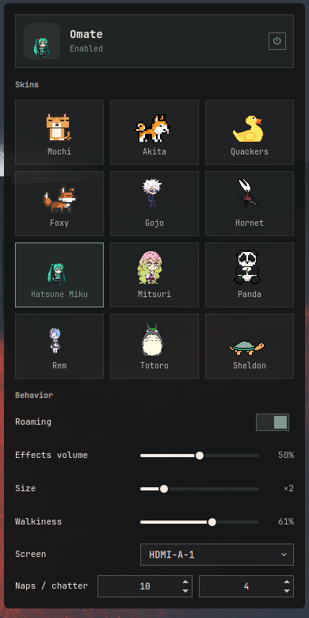
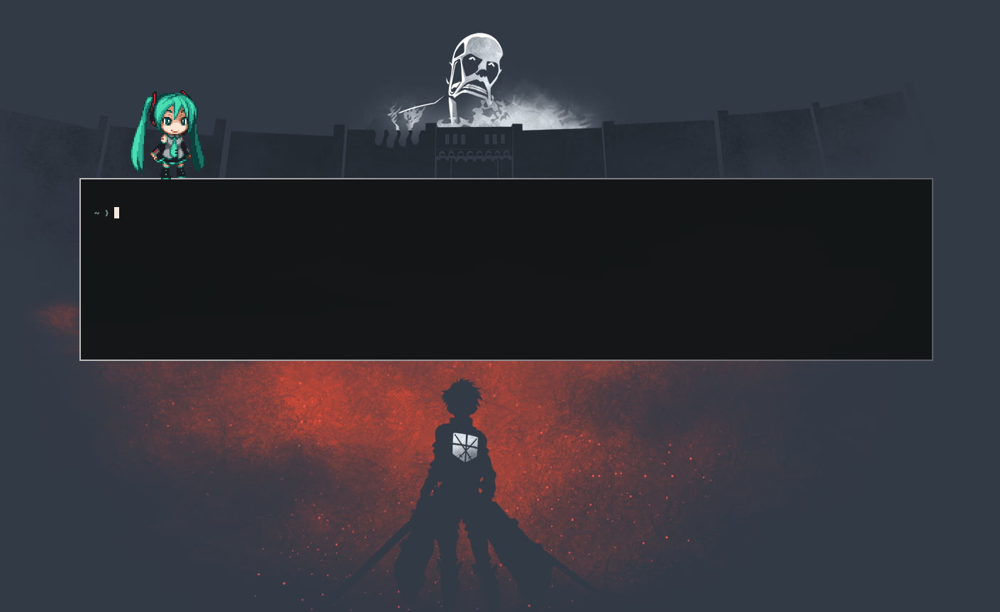
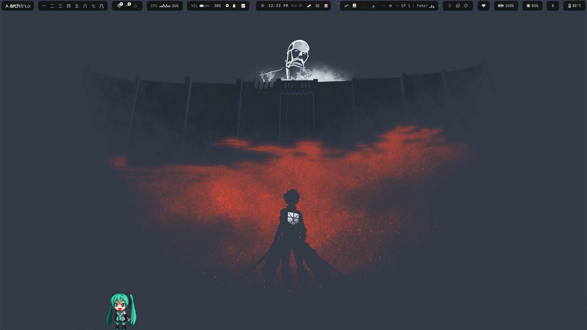

# Omate

A lightweight desktop mate for Omarchy: a little pixel cat that roams your
screen, rides along when you pick it up, purrs when you pet it, naps when
you ignore it, and drops by with messages. Pure QML on Quickshell — no AI,
no network, no dependencies beyond the shell you already run.

Inspired by [Mate-Engine](https://github.com/shinyflvre/Mate-Engine)'s
interaction model, built on the plugin pattern of
[omagotchi](https://github.com/SLcode777/omagotchi).


| Settings panel | Sitting on floating windows | Natural sizes |
|---|---|---|
|  |  |  |

Sitting works on any floating window — and she falls off when it closes.
Sizes range from the 24px cat up to 250px Totoro, settable per pack.

## Requirements

- [Omarchy](https://omarchy.org) with its Quickshell shell (the default)
- Hyprland (window tracking for window-sitting; the default)
- PipeWire's `pw-play` for sound effects (stock on Omarchy; mute in the
  panel)
- Optional, only for the character converters in `tools/`: `python3`
  (plus `pillow` for the GIF importer). The plugin itself never runs
  Python.

## Features

- **Crosses monitors**: drag her past a screen edge and the whole overlay
  follows to the neighboring output; a strong flung toss near an edge
  throws her across too. Falls, window-sitting and hopping all work on
  whichever screen she's on. If the screen she's on gets unplugged, she
  returns to the auto-picked home output.
- **Roams** the bottom edge of your screen (walks on top of the bar's
  reserved strip, never covers your work).
- **Sits on floating windows**: climbs up onto the tops of floating
  windows, rides along when you move them, and falls when the window
  closes, unfloats, or slides out from under it.
- **Drag & throw**: pick it up and toss it — real gravity, soft landings
  on window tops or the floor, and it gets dizzy if you drop it too far.
- **Pet it**: hold the mouse still on it for a moment — purrs and hearts.
  Petting a sleeping cat keeps it asleep.
- **Poke it**: a quick tap gets a mew and a startled face.
- **Sleeps** after 10 idle minutes (configurable), wakes when grabbed.
- **Speech bubbles**: idle chatter, event reactions, and any message you
  send it.
- **Sounds**: tiny synthesized blips (grab, purr, poke, thud, zzz, wake).
- **Menu**: right-click the cat for settings / window-hop / walk / nap /
  mute / hide.
- **Settings panel**: click the bar button (or the cat's "Settings…" menu
  entry) for a popup card styled like the plugin manager's rows — an
  animated sprite in the header, an enable/disable power switch in the top
  right, a **skin picker where every installed pack previews its own idle
  animation**, and live controls for roaming, volume, size, walkiness,
  home screen, and nap/chatter cadence.
- Click-through everywhere except the cat itself — your desktop stays
  fully usable.

## Install

The default Omarchy way — install straight from git:

```bash
omarchy plugin add https://github.com/Palccod/Omate.git --enable
```

That clones the plugin into `~/.config/omarchy/plugins/palccod.omate/`,
enables it, and the shell picks it up: a bar button appears in the right
section and the mate walks in on your desktop. Left click opens the
settings panel (skins, behavior, the power switch), middle click gives
the bar sprite a quick pet.

## Enable / disable

```bash
omarchy plugin enable palccod.omate     # bar widget + roaming mate return
omarchy plugin disable palccod.omate    # both disappear; files stay put
omarchy plugin list                     # see what's installed and enabled
```

The mate's own power switch in the settings panel only hides her —
disabling the plugin unloads the service itself.

## Update

```bash
omarchy plugin update palccod.omate
```

If the shell somehow keeps running old code after an update,
`omarchy restart shell`.

## Uninstall

```bash
omarchy plugin remove palccod.omate     # disables + deletes the plugin
```

Your mate's memory lives outside the plugin folder — remove these too if
you want a clean break:

```bash
rm -rf ~/.local/state/omarchy/omate-packs/   # imported characters
rm ~/.local/state/omarchy/omate-settings.json
rm ~/.local/state/omarchy/omate-state.json
```

For development, clone or link the repo into
`~/.config/omarchy/plugins/palccod.omate/` yourself, then run
`omarchy plugin enable palccod.omate` (or
`omarchy-shell shell rescanPlugins`) and `omarchy restart shell` after
editing files.


Characters are fan art of copyrighted characters: fine for personal
offline use, don't redistribute. Every imported pack keeps its author
credit in its own `pack.json`.

## Command line (IPC)

```sh
omarchy-shell omate say "Time to stretch!"
omarchy-shell omate pet
omarchy-shell omate poke
omarchy-shell omate wake          # or: doze
omarchy-shell omate setRoam false # or: toggleRoam
omarchy-shell omate hide          # or: show, toggleVisible
omarchy-shell omate setVolume 0.3
omarchy-shell omate setScale 4    # 1-6
omarchy-shell omate setScreen DP-1  # home output; "" = largest
omarchy-shell omate gotoScreen DP-1 # one-off trip: drop in from the top
omarchy-shell omate setPack miku   # or: setPack default
omarchy-shell omate packs          # list installed character packs
omarchy-shell omate hop            # teleport onto a random floating window
                                   # (or leap for joy if none are around)
omarchy-shell omate status
omarchy-shell palccod.omate toggle # open/close the settings panel
```

## Customize

Everything lives in plain files; edit and run `omarchy restart shell`.

- **Messages** — `packs/default/messages.json`: pools of lines the cat
  picks from (`greet`, `idle`, `drag`, `pet`, `poke`, `land`, `dizzy`,
  `sleep`, `wake`).
- **Settings** — `~/.local/state/omarchy/omate-settings.json`:
  `visible`, `roamEnabled`, `scale` (1–6), `walkiness` (0–1), `screen`
  (Hyprland output name, empty = largest), `soundVolume`, `sleepMinutes`,
  `chatterMinutes`. Every one of these is editable live from the settings
  panel; the file is just where they persist.
- **Sprites** — 24×24 PNGs in `packs/default/sprites/`, generated from
  ASCII grids in `tools/gen-sprites.py` (edit the grids, rerun the
  script). Missing animations fall back to idle, so you can add frames
  gradually.
- **Sounds** — WAV files in `sounds/`, named after events
  (`grab`, `pet`, `poke`, `land`, `zzz`, `wake`). Replace freely.

## Files

```
manifest.json          Omarchy plugin manifest (service + bar-widget)
Service.qml            Brain: settings, persistence, sleep, messages, sounds, IPC
OmateWindow.qml        Roaming overlay: physics, interactions, bubble, menu
OmatePanel.qml         Settings card: skin picker with previews, power switch
BarWidget.qml          Bar button (opens the panel, middle-click pets)
PetSprite.qml          Frame-by-frame sprite animator
packs/default/         Sprites, pack.json (sizes/timings), messages.json
sounds/                Synthesized event blips
tools/                 Sprite & sound generators (pure Python stdlib)
```

State (position, nap status) persists in
`~/.local/state/omarchy/omate-state.json` and is restored on login.

## Privacy & security

- **No network access** — fully offline; nothing is ever downloaded or
  phoned home
- **No privileged behavior** — no sudo, pkexec, systemctl, or services
- **File access** — reads and writes only its own state under
  `~/.local/state/omarchy/`: `omate-settings.json`, `omate-state.json`,
  and `omate-packs/` (characters you import yourself). Writes are atomic;
  reads are size-capped
- **Process execution** — exactly two things, always with fixed argument
  arrays: `pw-play` for the bundled sound effects, and `head -c` for
  bounded reads of its own state and pack files. Nothing is executed at
  install time and nothing is downloaded
- **No data collection** — no telemetry, no clipboard access, no
  credentials

## Notes

- The mate lives on the `Top` layer-shell layer: above your windows,
  below fullscreen apps (a fullscreen app covers it — same as the bar).
- Like every Omarchy shell plugin it runs inside the main shell instance;
  restart the shell after changing files.
